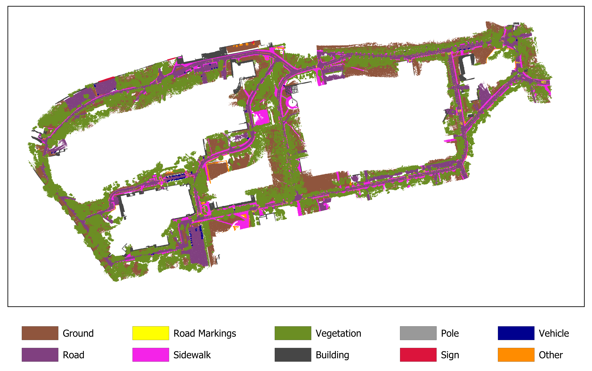

# ITU-Campus3D: A Campus-Scale Urban Mobile Mapping Benchmark for Semantic Segmentation

[](https://doi.org/10.1109/ACCESS.2026.3682205)
[](https://doi.org/10.1109/ACCESS.2026.3682205)
[](https://creativecommons.org/licenses/by/4.0/)
[](https://github.com/aksuko/ITU-Campus3D)
[](https://github.com/aksuko/ITU-Campus3D)


---

## Table of Contents

- [Dataset Overview](#dataset-overview)
- [Study Area](#study-area)
- [Acquisition Platform](#acquisition-platform)
- [Data Modalities and Features](#data-modalities-and-features)
- [Semantic Classes](#semantic-classes)
- [Dataset Access and Preview](#dataset-access-and-preview)
- [Dataset Directory Structure](#dataset-directory-structure)
- [License](#license)
- [Acknowledgments](#acknowledgments)

---

## Dataset Overview

| Property | Value |
| :--- | :--- |
| **Dataset Name** | ITU-Campus3D |
| **Acquisition Method** | Mobile Laser Scanning (MLS) |
| **Environment Type** | Campus Environment |
| **Number of Classes** | 10 |
| **Primary Task** | 3D Semantic Segmentation |
| **Data Modalities** | XYZ, RGB, Intensity, Semantic Labels |

## Study Area

The study area contains a diverse set of urban structures and landscape elements, providing substantial structural variability for semantic scene understanding tasks.

| Property | Details |
| :--- | :--- |
| **Location** | Ayazağa Campus, Istanbul Technical University (ITU) |
| **Coordinate System** | ETRS89 / UTM Zone 35N (EPSG:3047) |
| **Key Features** | Road surfaces, sidewalks, vegetation, buildings, traffic infrastructure, and vehicles. |

## Acquisition Platform

The mobile mapping platform integrates multiple sensors to ensure accurate georeferencing, trajectory estimation, and high-fidelity colorization of 3D point clouds.

| Sensor Type | Model / Details | Purpose |
| :--- | :--- | :--- |
| **LiDAR** | Velodyne HDL-32E | 3D point cloud acquisition |
| **GNSS** | Dual GNSS receivers | Global positioning |
| **IMU** | Inertial Measurement Unit | Trajectory estimation |
| **Odometry** | Wheel encoder | Motion estimation |
| **Camera** | Ladybug 5+ panoramic camera | 3D point cloud colorization |

## Data Modalities and Features

These features enable both traditional geometric analysis and deep learning-based semantic segmentation workflows.

| Attribute | Description |
| :--- | :--- |
| **XYZ** | Geographical coordinates |
| **RGB** | RGB color information from panoramic imagery |
| **Intensity** | LiDAR intensity |
| **Semantic Label** | Ground-truth semantic classes |

## Semantic Classes

The dataset is categorized into **10 semantic classes**, addressing a wide spectrum of urban objects:

| ID | Class | Description |
| :-: | :--- | :--- |
| `0` | **Ground** | Soil, natural earth, and non-road natural surfaces. |
| `1` | **Road** | Vehicle lanes, cycling lanes, and asphalt road surfaces. |
| `2` | **Road markings** | Lane lines, arrows, crosswalks, stop lines, and surface markings. |
| `3` | **Sidewalk** | Pedestrian walking areas and paved sidewalks. |
| `4` | **Vegetation** | Trees, bushes, grass, and general plant life. |
| `5` | **Building** | Building facades, walls, and permanent structural elements. |
| `6` | **Pole** | Light poles, traffic signal poles, and similar vertical supports. |
| `7` | **Sign** | Informational panels and billboards. |
| `8` | **Vehicle** | Cars, vans, and similar motorized vehicles. |
| `9` | **Other** | Objects not belonging to any predefined semantic class, such as vase, bin, and bench. |

---

---

## Dataset Access and Preview

### Full Dataset Access

To request access, please fill out the form below:

**[Request Dataset Access](https://forms.gle/uyYhk84pwvfGnjui9)**


### Dataset Preview

Orthogonal visualization of a representative labeled scene from the ITU-Campus3D dataset.  



---

## Dataset Directory Structure

The dataset will be provided in one of the directory structures below. 

```
ITU-Campus3D/
├── train/            
│   └── 0_13.las      # Training tiles (*.las)
├── val/              
│   └── 57_20.las     # Validation tiles (*.las)
├── test/             
│   └── 50_12.las     # Testing tiles (*.las)
└── buffer/           
    └── 48_12.las     # Buffer tiles (*.las)
```

## Citation

If you use ITU-Campus3D in your research, please cite our paper:

```bibtex
@ARTICLE{11477876,
  author={Aksu, Koray and Demirel, Hande and Alkan, Reha Metin and Yanalak, Mustafa},
  journal={IEEE Access}, 
  title={ITU-Campus3D: A Campus-Scale Urban Mobile Mapping Benchmark for Semantic Segmentation}, 
  year={2026},
  volume={14},
  number={},
  pages={1-20},
  keywords={3D point cloud;campus environment;class imbalance;digital twin;mobile laser scanning;semantic segmentation;urban scene understanding},
  doi={10.1109/ACCESS.2026.3682205}}

```


---

## License

The ITU-Campus3D dataset is released under the Creative Commons Attribution 4.0 (CC BY 4.0).

## Acknowledgments

This work was supported by Istanbul Technical University Scientific Research Projects Coordination Unit (Production of High-Definition Maps (HD Maps) for Istanbul Technical University Ayazaga Campus Digital Road Infrastructure under Project MGA-2022-43340).
